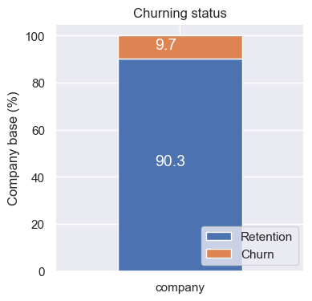
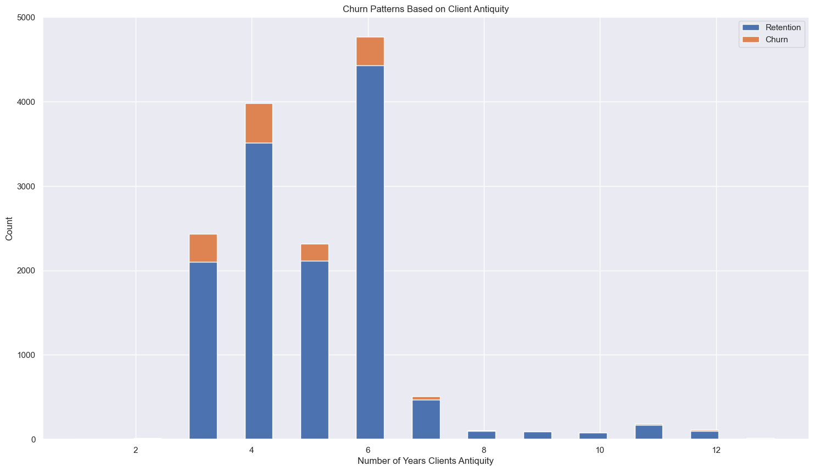
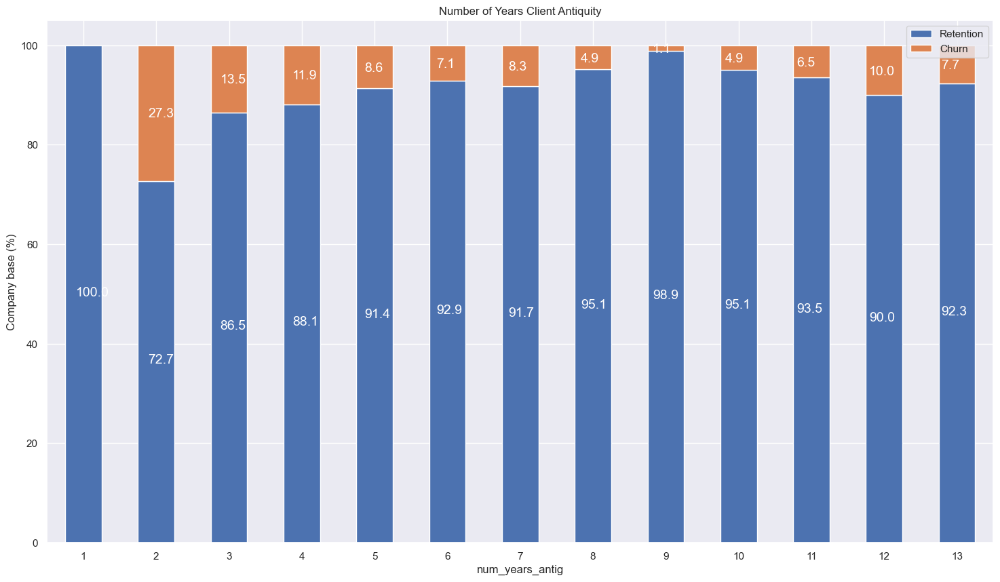

# BCG Data Science Job Simulation: Customer Churn Prediction with a Classification Model

## Project Overview
- Completed a customer churn analysis simulation for PowerCo, demonstrating advanced data analytics skills, identifying essential client data and outlining a strategic investigation approach.
- Conducted efficient data analysis using Python, including Pandas and Numpy. Employed data visualization techniques for insightful trend interpretation, including bar chart, line chart, histogram and heatmap.
- Completed the feature engineering and optimization of a random forest model, achieving a 90% accuracy rate in predicting customer churn. Conducted further evaluations on a confusion matrix, the precision and recall scores, and importance of different features.
- Completed a concise executive summary for BCG Associate Director, delivering actionable insights for informed decision-making based on analysis.

## Code and Resources Used
**Python:** 3.11.3 \
**Packages:** pandas, numpy, seaborn, matplotlib\
**Data Sources:**: https://www.theforage.com/simulations/bcg/data-science-ccdz\

## EDA
First, I calculated and visualized the churn percentage based on different variables. Below is a stacked bar chart showing that the churn is indeed high with 9.7% across 14606 customers. I also found that the fewer years the company has been contracted with PowerCo, the higher chance it will churn.

Next, I explored the price patterns in terms of the month of year and different peak periods.

