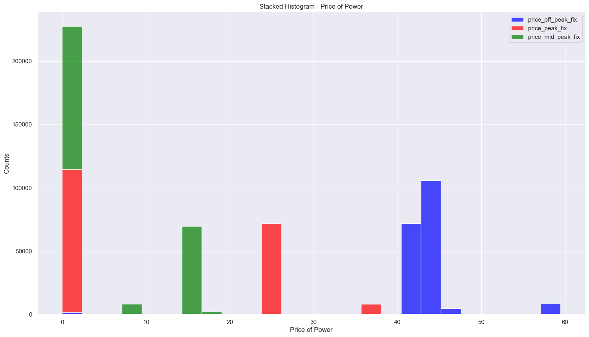
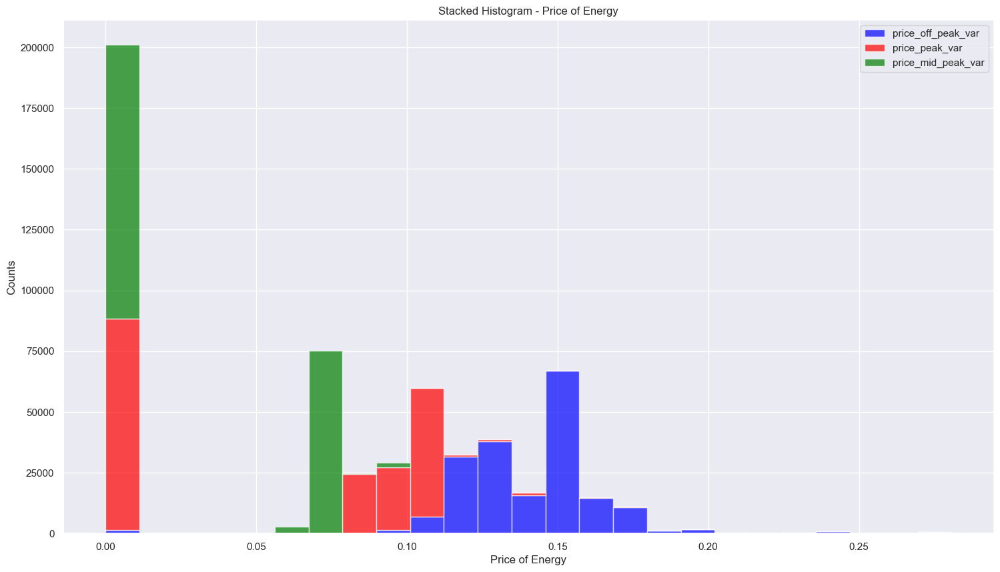
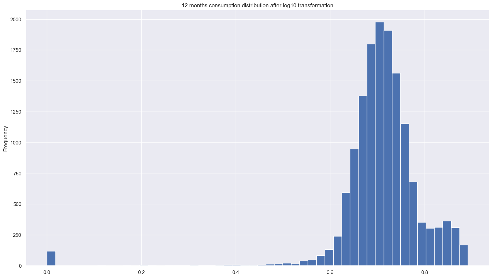
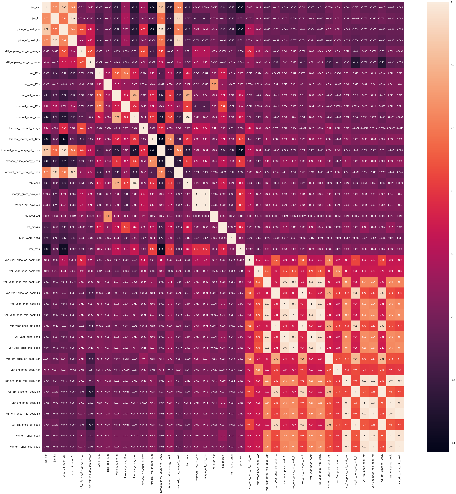
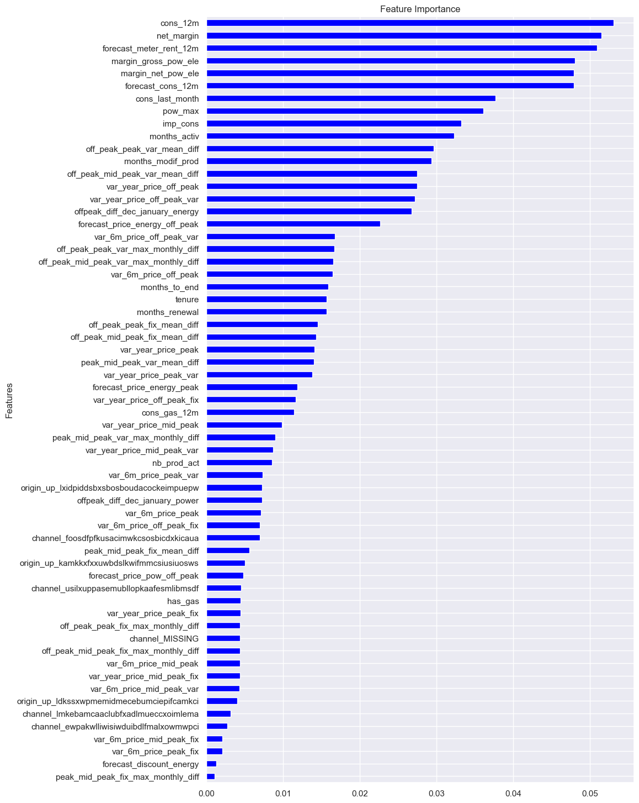

# BCG Data Science Job Simulation: Customer Churn Prediction with a Classification Model

## Project Overview
- Completed a customer churn analysis simulation for PowerCo, demonstrating advanced data analytics skills, identifying essential client data and outlining a strategic investigation approach.
- Conducted efficient data analysis using Python, including Pandas and Numpy. Employed data visualization techniques for insightful trend interpretation, including bar chart, line chart, histogram and heatmap.
- Completed the feature engineering and optimization of a random forest model, achieving a 90% accuracy rate in predicting customer churn. Conducted further evaluations on a confusion matrix, the precision and recall scores, and importance of different features.
- Completed a concise executive summary for BCG Associate Director, delivering actionable insights for informed decision-making based on analysis.

## Code and Resources Used
**Python:** 3.11.3 \
**Packages:** pandas, numpy, seaborn, matplotlib\
**Data Sources:**: https://www.theforage.com/simulations/bcg/data-science-ccdz\

## EDA
First, I calculated and visualized the churn percentage based on different variables. Below is a stacked bar chart showing that the churn is indeed high with 9.7% across 14606 customers. I also found that the fewer years the company has been contracted with PowerCo, the higher chance it will churn.

Next, I explored the price patterns in terms of the month of year and different peak periods. Interestly, off peak energy and power prices are mostly higher than peak and mid peak period prices. 

In addition, we found out substantial differences betweeen off-peak prices in December and January in the preceding year. This led us to engineer a new feature to show the difference between off-peak prices in December and the precedding January.

#group off peak prices by company id and price date

id_monthly_off_peak = price_df.groupby(['id','price_date']).agg({'price_off_peak_var':'mean', 'price_off_peak_fix':'mean'}).reset_index()

#get Jan and Dec price

jan_price = price_df.groupby('id')[['price_date','price_off_peak_var','price_off_peak_fix']].first().reset_index()

dec_price = price_df.groupby('id')[['price_date','price_off_peak_var','price_off_peak_fix']].last().reset_index()

#calculate the difference

diff = pd.merge(jan_price.rename(columns={'price_off_peak_var':'jan_var','price_off_peak_fix':'jan_fix'}), dec_price.drop(columns='price_date'), on='id')

diff['diff_offpeak_dec_jan_energy'] = diff['price_off_peak_var'] - diff['jan_var']

diff['diff_offpeak_dec_jan_power'] = diff['price_off_peak_fix'] - diff['jan_fix']

Due to the highly skewed data, we also apply log10 transformation to key features in the model, making the standard deviation much lower, and the data more stable to use in the modeling.

### Correlation

The heatmap shows how features within the model are correlated.

### Random Forest Model

model = RandomForestClassifier(n_estimators=1000) #10000 decision trees
model.fit(x_train,y_train)

The accuracy score is: 0.90389

The precision score is: 0.85714

The recall score is: 0.04918

true negative: 3283

false positive: 3

false negative: 348

true positive: 18

## Evaluations

Within the test set, about 10% of the custormers churned.

Looking at the true negative, we have 3283 out of 3286, meaning out of all negatives cases (churn=0) from the test set, we predicted 3283 correctly. This is great!

Looking at the false negative, we have predicted 348 cases, meaning 348 churned customers are predicted incorrectly as loyal customers (churn=0). The false negative is too high and the model needs to be improved to address this issue.
Looking at the false postive, we have 3, meaning 3 loyal customers are incorrectly predicted as churned customers.
Looking at true positive, we have correctly predicted 18 cases. In the actual test set, 366 customers actually churned, making the value of true positive look very low.

Therefore, the 90% accuracy score can be misleading, and it's important to evaluate precision and recall as well.
The precision score of 0.857 is not bad. However, the recall score is only 0.049, showing this classification model has a very poor ability to identify positive models.

## Conclusoin

The model is able to accurately identify customers that won't churn, but is not able to accurately identify customers that will churn. High percentage of clients are identified as not churning when they should be identified as churning. This shows that the current model and features are not effective enough to cleary distinguish between churners vs non-churners.

## Findings
- Net margin and consumption over 12 months are top drivers for churn in this model.
- Margin on power subscription is also influential.
- Among all time factors, the number of months that the client is active is the most influential, followed by months to end, tenure, and months to renewal.
- The new engineered feature, december and proceding january energy price is also in the top half influential factors.
- Features about prices are scatter around, not showing as top drivers for churn. Thus, the churn is not driven by price sensitivity.
